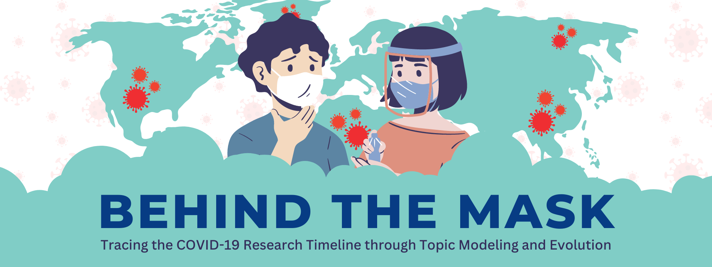

# behindthemask
COVID-19 cases are again on the rise in the Philippines. And the CDC has been actively tracking more than 22 variants as of this year. The key question is how we can utilize topic modeling techniques to identify underlying research themes that can enhance both current and future COVID-19 efforts.
